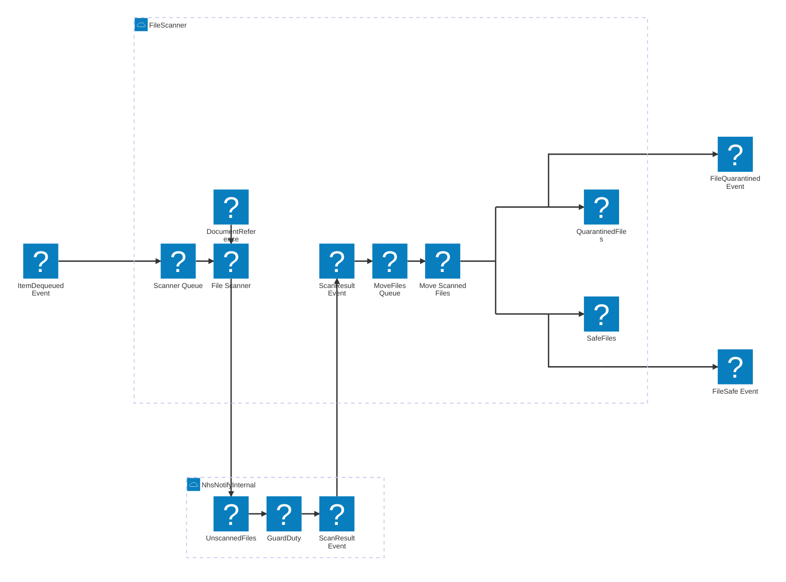

---

title: c4code-file-scanner
---

```mermaid
architecture-beta
    group fileScanner(cloud)[FileScanner]
    group internal(cloud)[NhsNotifyInternal]

    service itemDequeued(aws:res-amazon-eventbridge-event)[ItemDequeued Event]
    service scannerQueue(logos:aws-sqs)[Scanner Queue] in fileScanner
    service scannerLambda(logos:aws-lambda)[File Scanner] in fileScanner
    service moveQueue(logos:aws-sqs)[MoveFiles Queue] in fileScanner
    service moveLambda(logos:aws-lambda)[Move Scanned Files] in fileScanner
    service docRefBucket(logos:aws-s3)[DocumentReference] in fileScanner
    service unscannedBucket(logos:aws-s3)[UnscannedFiles] in internal
    service quarantineBucket(logos:aws-s3)[QuarantinedFiles] in fileScanner
    service safeBucket(logos:aws-s3)[SafeFiles] in fileScanner
    service guardDuty(aws:arch-amazon-guardduty)[GuardDuty] in internal
    service scanResultInternal(aws:res-amazon-eventbridge-event)[ScanResult Event] in internal
    service scanResultDL(aws:res-amazon-eventbridge-event)[ScanResult Event] in fileScanner
    service safeFile(aws:res-amazon-eventbridge-event)[FileSafe Event]
    service quarantinedFile(aws:res-amazon-eventbridge-event)[FileQuarantined Event]
    junction j1 in fileScanner
    junction j2 in fileScanner
    junction j3 in fileScanner
    junction j4 in fileScanner
    junction j5 in fileScanner
    junction j6 in fileScanner
    junction j7 in fileScanner
    junction j8 in fileScanner
    junction j9 in fileScanner

    itemDequeued:R --> L:scannerQueue
    docRefBucket:B --> T:scannerLambda
    scannerQueue:R --> L:scannerLambda
    scannerLambda:B --> T:unscannedBucket

    unscannedBucket:R --> L:guardDuty
    guardDuty:R --> L:scanResultInternal
    scanResultInternal:T --> B:scanResultDL


    scanResultDL:R --> L:moveQueue
    moveQueue:R --> L:moveLambda

    moveLambda:R -- L:j3
    j3:T -- B:j4
    j4:R -- L:j5
    j5:R --> L:quarantineBucket
    j5:T -- L:j6
    j6:R --> L:quarantinedFile

    j3:B -- T:j7
    j7:R -- L:j8
    j8:R --> L:safeBucket
    j8:B -- L:j9
    j9:R --> L:safeFile
```
