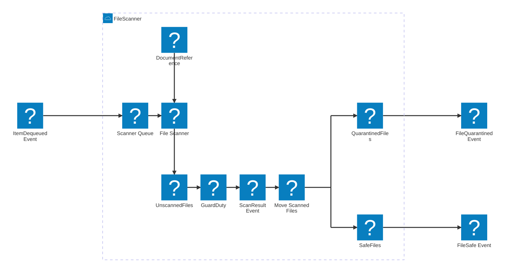

---

title: c4code-file-scanner
---

```mermaid
architecture-beta
    group fileScanner(cloud)[FileScanner]
    service itemDequeued(aws:res-amazon-eventbridge-event)[ItemDequeued Event]
    service scannerQueue(logos:aws-sqs)[Scanner Queue] in fileScanner
    service scannerLambda(logos:aws-lambda)[File Scanner] in fileScanner
    service moveLambda(logos:aws-lambda)[Move Scanned Files] in fileScanner
    service docRefBucket(logos:aws-s3)[DocumentReference] in fileScanner
    service unscannedBucket(logos:aws-s3)[UnscannedFiles] in fileScanner
    service quarantineBucket(logos:aws-s3)[QuarantinedFiles] in fileScanner
    service safeBucket(logos:aws-s3)[SafeFiles] in fileScanner
    service guardDuty(aws:arch-amazon-guardduty)[GuardDuty] in fileScanner
    service scanComplete(aws:res-amazon-eventbridge-event)[ScanResult Event]
    service safeFile(aws:res-amazon-eventbridge-event)[FileSafe Event]
    service quarantinedFile(aws:res-amazon-eventbridge-event)[FileQuarantined Event]
    junction j1 in fileScanner
    junction j2 in fileScanner
    junction j3 in fileScanner

    itemDequeued:R --> L:scannerQueue
    docRefBucket:B --> T:scannerLambda
    scannerQueue:R --> L:scannerLambda
    scannerLambda:B --> T:unscannedBucket
    unscannedBucket:R --> L:guardDuty
    guardDuty:R --> L:scanComplete
    scanComplete:R --> L:moveLambda
    moveLambda:R -- L:j1
    j1:T -- B:j2
    j1:B -- T:j3
    j2:R --> L:quarantineBucket
    j3:R --> L:safeBucket
    quarantineBucket:R --> L:quarantinedFile
    safeBucket:R --> L:safeFile

```
