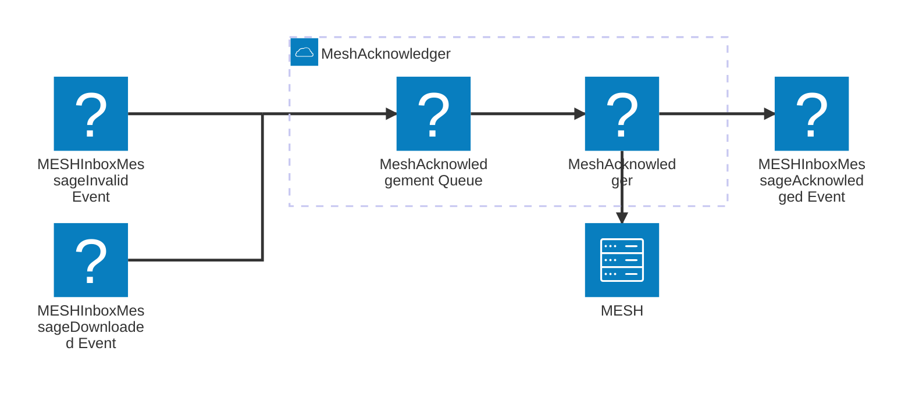

---

title: c4code-mesh-acknowledger

---

```mermaid
architecture-beta
    group meshAcknowledger(cloud)[MeshAcknowledger]
    service meshDownloaded(aws:res-amazon-eventbridge-event)[MESHInboxMessageDownloaded Event]
    service meshInvalid(aws:res-amazon-eventbridge-event)[MESHInboxMessageInvalid Event]
    service meshAcknowledged(aws:res-amazon-eventbridge-event)[ MESHInboxMessageAcknowledged Event]
    service meshAckQueue(logos:aws-sqs)[MeshAcknowledgement Queue] in meshAcknowledger
    service meshAckLambda(logos:aws-lambda)[MeshAcknowledger] in meshAcknowledger
    service mesh(server)[MESH]

    junction j1

    meshDownloaded:R -- T:j1
    meshInvalid:R -- L:j1
    j1:R --> L:meshAckQueue
    meshAckQueue:R --> L:meshAckLambda
    meshAckLambda:B --> T:mesh
    meshAckLambda:R --> L:meshAcknowledged
```
