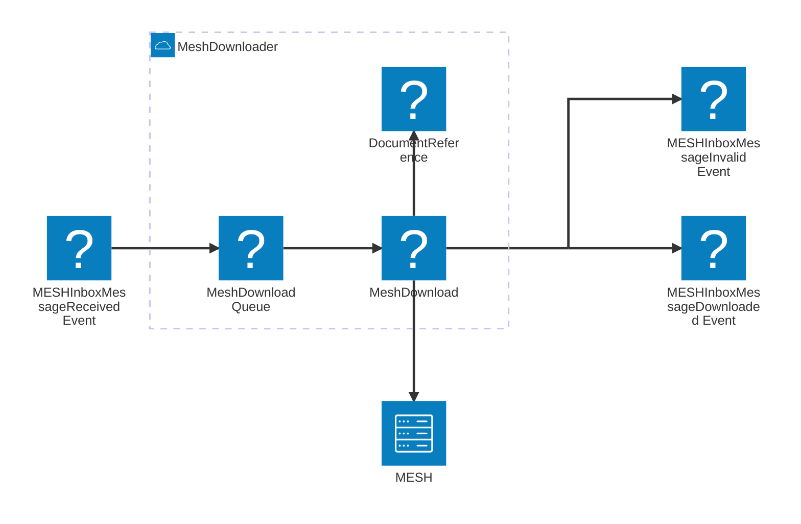

---

title: c4code-mesh-downloader

---

```mermaid
architecture-beta
    group meshRetriever(cloud)[MeshDownloader]
    service meshReceived(aws:res-amazon-eventbridge-event)[MESHInboxMessageReceived Event]
    service meshDownloaded(aws:res-amazon-eventbridge-event)[ MESHInboxMessageDownloaded Event]
    service meshInvalid(aws:res-amazon-eventbridge-event)[ MESHInboxMessageInvalid Event]
    service meshDownloadQueue(logos:aws-sqs)[MeshDownload Queue] in meshRetriever
    service meshDownloadLambda(logos:aws-lambda)[MeshDownload] in meshRetriever
    service mesh(server)[MESH]
    service s3(logos:aws-s3)[DocumentReference] in meshRetriever
    junction j1

    meshReceived:R --> L:meshDownloadQueue
    meshDownloadQueue:R --> L:meshDownloadLambda
    meshDownloadLambda:T --> B:s3
    meshDownloadLambda:B --> T:mesh
    meshDownloadLambda:R -- L:j1
    j1:T --> L:meshInvalid
    j1:R --> L:meshDownloaded
```
