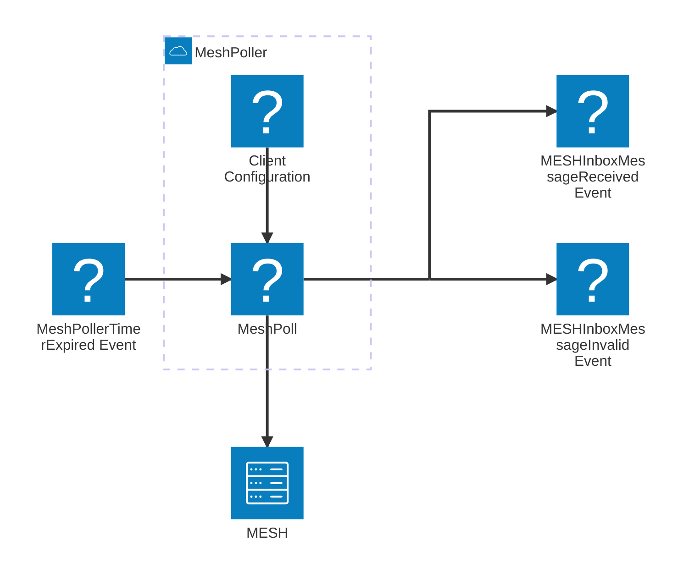

---

title: c4code-mesh-poller

---

```mermaid
architecture-beta
    group meshPoller(cloud)[MeshPoller]
    service meshDownloaded(aws:res-amazon-eventbridge-event)[MeshPollerTimerExpired Event]
    service meshReceived(aws:res-amazon-eventbridge-event)[MESHInboxMessageReceived Event]
    service meshInvalid(aws:res-amazon-eventbridge-event)[MESHInboxMessageInvalid Event]
    service meshPollLambda(logos:aws-lambda)[MeshPoll] in meshPoller
    service clientConfig(aws:res-aws-systems-manager-parameter-store)[Client Configuration] in meshPoller
    service mesh(server)[MESH]

    junction j1

    meshDownloaded:R --> L:meshPollLambda
    clientConfig:B --> T:meshPollLambda
    meshPollLambda:B --> T:mesh
    meshPollLambda:R -- L:j1
    j1:T --> L:meshReceived
    j1:R --> L:meshInvalid

```
