---

title: c4code-mesh-statusreporter-generator

---

## Decisions

1. ReportSchedulder lambda publishes a `GenerateReport` event for every known client
2. The event data payload contains the `senderId` so the ReportGenerator lambda knows which trust to generate a report for.

```mermaid
architecture-beta
    group reportGenerator(cloud)[ReportGenerator]
    service generateReportEvent(aws:res-amazon-eventbridge-event)[GenerateReport Event]
    service sqs(logos:aws-sqs)[ReportGenerator Queue] in reportGenerator
    service reportGeneratorLambda(logos:aws-lambda)[Report Generator] in reportGenerator
    service s3(logos:aws-s3)[Reports] in reportGenerator
    service reportsdb(aws:arch-amazon-athena)[Reports] in reportGenerator
    service reportGeneratedEvent(aws:res-amazon-eventbridge-event)[ReportGenerated Event]

    generateReportEvent:R --> L:sqs
    sqs:R --> L:reportGeneratorLambda
    reportGeneratorLambda:T <-- B:reportsdb
    reportGeneratorLambda:B --> T:s3
    reportGeneratorLambda:R --> L:reportGeneratedEvent
```

