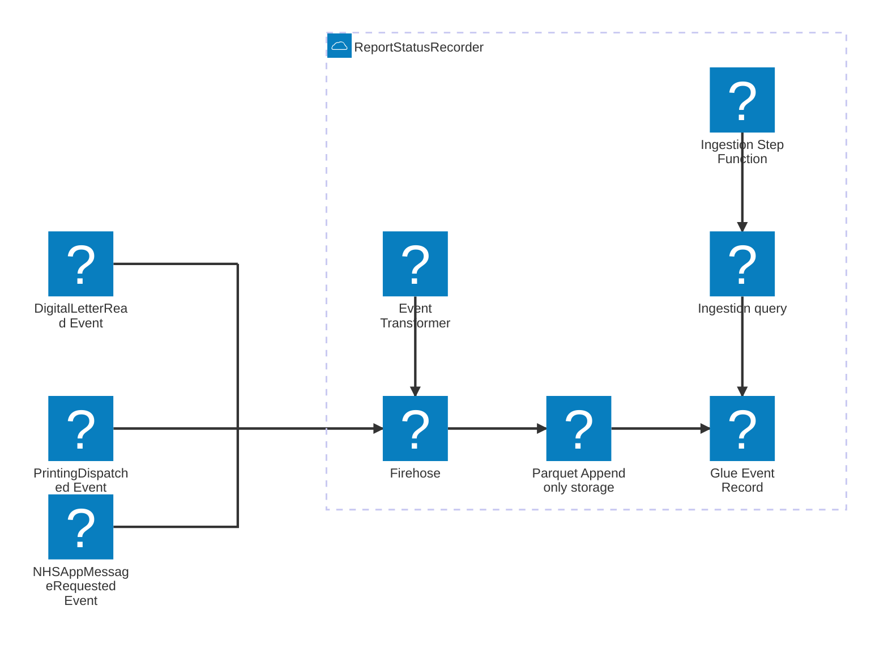

---

title: c4code-mesh-statusreporter-recorder

---

```mermaid
architecture-beta
    group statusRecorder(cloud)[ReportStatusRecorder]
    service report1Event(aws:res-amazon-eventbridge-event)[DigitalLetterRead Event]
    service report2Event(aws:res-amazon-eventbridge-event)[PrintingDispatched Event]
    service report3Event(aws:res-amazon-eventbridge-event)[NHSAppMessageRequested Event]
    service firehose(aws:arch-amazon-data-firehose)[Firehose] in statusRecorder
    service transformLambda(logos:aws-lambda)[Event Transformer] in statusRecorder
    service parquet(logos:aws-s3)[Parquet Append only storage] in statusRecorder
    service stepFunction(aws:arch-aws-step-functions)[Ingestion Step Function] in statusRecorder
    service athena(aws:arch-amazon-athena)[Ingestion query] in statusRecorder
    service glue(aws:arch-aws-glue)[Glue Event Record] in statusRecorder
    junction j1
    junction j2

    j2:B -- T:j1
    report1Event:R -- L:j2
    report2Event:R -- L:j1
    report3Event:R -- B:j1

    j1:R --> L:firehose
    transformLambda:B --> T:firehose
    firehose:R --> L:parquet
    stepFunction:B --> T:athena
    parquet:R --> L:glue
    athena:B --> T:glue

```
