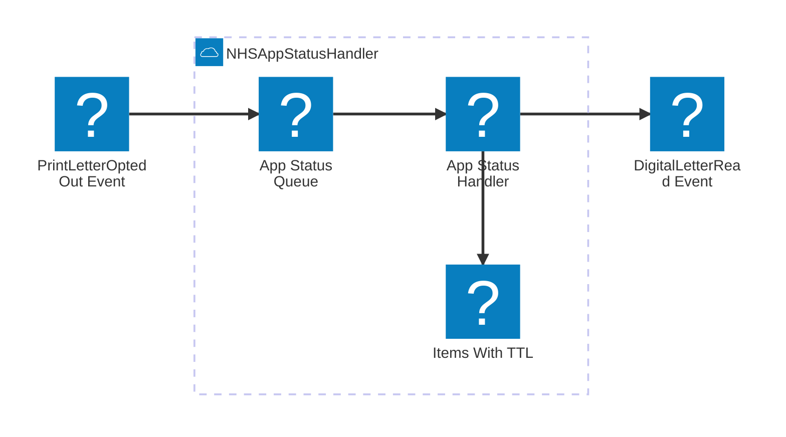

---

title: c4code-nhsapp-status-handler

---

```mermaid
architecture-beta
    group AppStatusHandler(cloud)[NHSAppStatusHandler]
    service optedOutEvent(aws:res-amazon-eventbridge-event)[PrintLetterOptedOut Event]
    service lambda(logos:aws-lambda)[App Status Handler] in AppStatusHandler
    service sqs(logos:aws-sqs)[App Status Queue] in AppStatusHandler
    service ddb(aws:arch-amazon-dynamodb)[Items With TTL] in AppStatusHandler
    service docReadEvent(aws:res-amazon-eventbridge-event)[DigitalLetterRead Event]

    optedOutEvent:R --> L:sqs
    sqs:R --> L:lambda
    lambda:B --> T:ddb
    lambda:R --> L:docReadEvent
```
