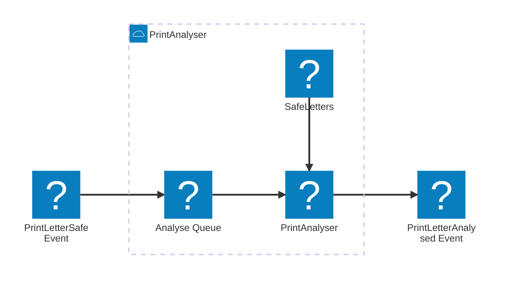

---

title: c4code-printer-analyser
---

```mermaid
architecture-beta
    service letterSafe(aws:res-amazon-eventbridge-event)[PrintLetterSafe Event]
    service analyseQueue(logos:aws-sqs)[Analyse Queue] in printAnalyser
    service analyseLambda(logos:aws-lambda)[PrintAnalyser] in printAnalyser
    service safeBucket(logos:aws-s3)[SafeLetters] in printAnalyser
    service letterAnalysed(aws:res-amazon-eventbridge-event)[PrintLetterAnalysed Event]
    group printAnalyser(cloud)[PrintAnalyser]

    letterSafe:R --> L:analyseQueue
    analyseQueue:R --> L:analyseLambda
    safeBucket:B --> T:analyseLambda
    analyseLambda:R --> L:letterAnalysed


```
