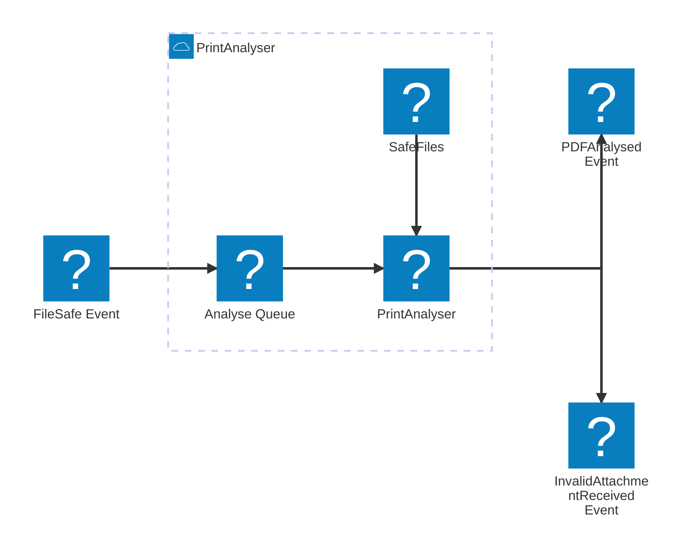

---

title: c4code-printer-analyser
---

```mermaid
architecture-beta
    service fileSafe(aws:res-amazon-eventbridge-event)[FileSafe Event]
    service analyseQueue(logos:aws-sqs)[Analyse Queue] in printAnalyser
    service analyseLambda(logos:aws-lambda)[PrintAnalyser] in printAnalyser
    service safeBucket(logos:aws-s3)[SafeFiles] in printAnalyser
    service pdfAnalysed(aws:res-amazon-eventbridge-event)[PDFAnalysed Event]
    service invalidAttachment(aws:res-amazon-eventbridge-event)[InvalidAttachmentReceived Event]
    group printAnalyser(cloud)[PrintAnalyser]

    junction j1

    fileSafe:R --> L:analyseQueue
    analyseQueue:R --> L:analyseLambda
    safeBucket:B --> T:analyseLambda
    analyseLambda:R -- L:j1
    j1:T --> B:pdfAnalysed
    j1:B --> T:invalidAttachment


```
