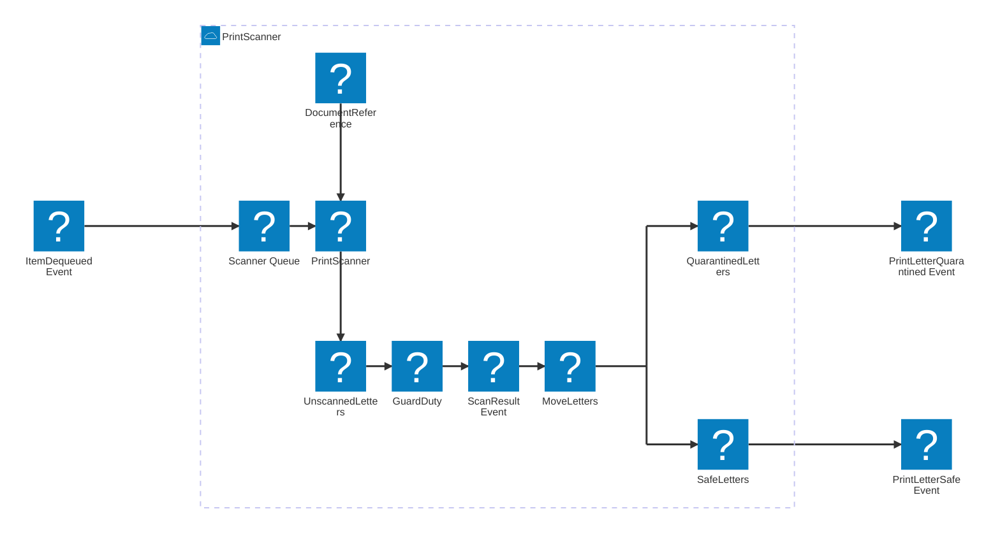

---

title: c4code-printer-scanner
---

```mermaid
architecture-beta
    group printScanner(cloud)[PrintScanner]
    service itemDequeued(aws:res-amazon-eventbridge-event)[ItemDequeued Event]
    service scannerQueue(logos:aws-sqs)[Scanner Queue] in printScanner
    service scannerLambda(logos:aws-lambda)[PrintScanner] in printScanner
    service moveLambda(logos:aws-lambda)[MoveLetters] in printScanner
    service docRefBucket(logos:aws-s3)[DocumentReference] in printScanner
    service unscannedBucket(logos:aws-s3)[UnscannedLetters] in printScanner
    service quarantineBucket(logos:aws-s3)[QuarantinedLetters] in printScanner
    service safeBucket(logos:aws-s3)[SafeLetters] in printScanner
    service guardDuty(aws:arch-amazon-guardduty)[GuardDuty] in printScanner
    service scanComplete(aws:res-amazon-eventbridge-event)[ScanResult Event]
    service safeLetter(aws:res-amazon-eventbridge-event)[PrintLetterSafe Event]
    service quarantinedLetter(aws:res-amazon-eventbridge-event)[PrintLetterQuarantined Event]
    junction j1 in printScanner
    junction j2 in printScanner
    junction j3 in printScanner

    itemDequeued:R --> L:scannerQueue
    docRefBucket:B --> T:scannerLambda
    scannerQueue:R --> L:scannerLambda
    scannerLambda:B --> T:unscannedBucket
    unscannedBucket:R --> L:guardDuty
    guardDuty:R --> L:scanComplete
    scanComplete:R --> L:moveLambda
    moveLambda:R -- L:j1
    j1:T -- B:j2
    j1:B -- T:j3
    j2:R --> L:quarantineBucket
    j3:R --> L:safeBucket
    quarantineBucket:R --> L:quarantinedLetter
    safeBucket:R --> L:safeLetter

```
