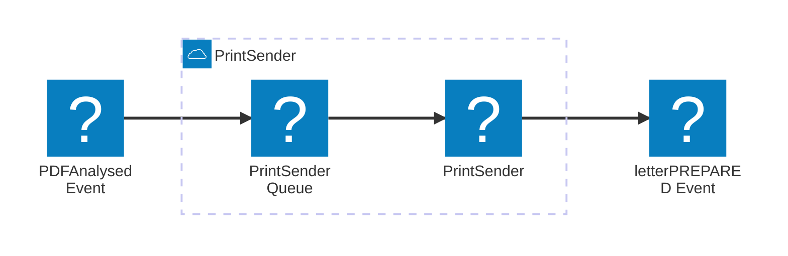

---

title: c4code-printer-sender

---

```mermaid
architecture-beta
    service pdfAnalysed(aws:res-amazon-eventbridge-event)[PDFAnalysed Event]
    service printQueue(logos:aws-sqs)[PrintSender Queue] in printSender
    service printLambda(logos:aws-lambda)[PrintSender] in printSender
    service letterPrepared(aws:res-amazon-eventbridge-event)[letterPREPARED Event]
    group printSender(cloud)[PrintSender]

    pdfAnalysed:R --> L:printQueue
    printQueue:R --> L:printLambda
    printLambda:R --> L:letterPrepared


```
