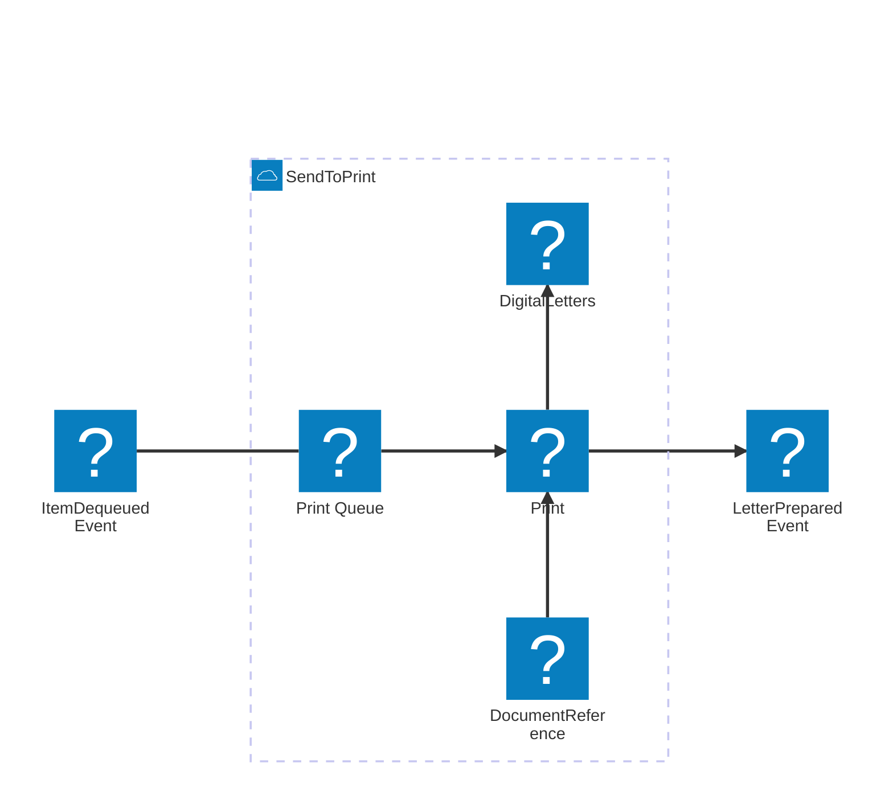

---

title: c4code-printer-sendtoprint

---

```mermaid
architecture-beta
    service itemDequeued(aws:res-amazon-eventbridge-event)[ItemDequeued Event]
    service printQueue(logos:aws-sqs)[Print Queue] in sendToPrint
    service printLambda(logos:aws-lambda)[Print] in sendToPrint
    service docRefBucket(logos:aws-s3)[DocumentReference] in sendToPrint
    service digLtrsBucket(logos:aws-s3)[DigitalLetters] in sendToPrint
    service letterPrepared(aws:res-amazon-eventbridge-event)[LetterPrepared Event]
    group sendToPrint(cloud)[SendToPrint]
    junction j1


    itemDequeued:R -- L:printQueue
    printQueue:R --> L:printLambda
    printLambda:B <-- T:docRefBucket
    printLambda:T --> B:digLtrsBucket
    printLambda:R --> L:letterPrepared


```
