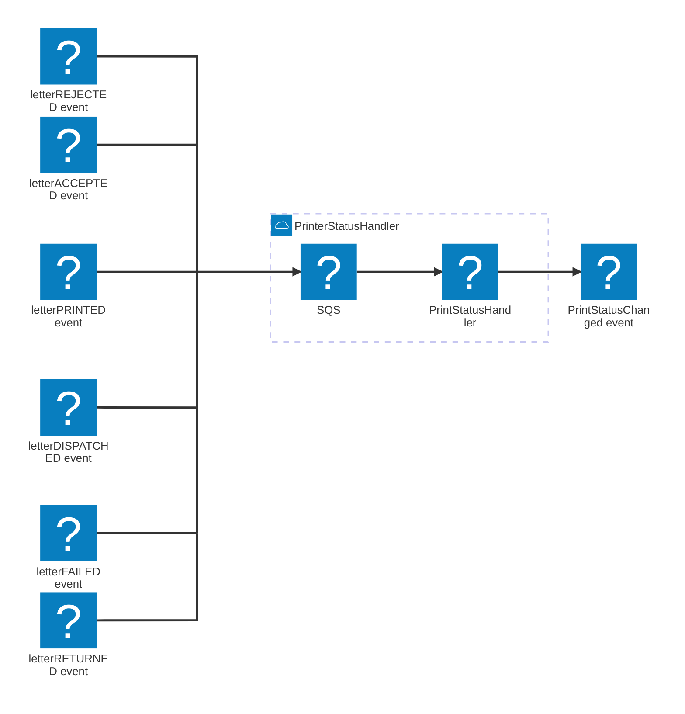

```mermaid
   architecture-beta
    group printStatusHandler(cloud)[PrinterStatusHandler]


    service createLambda(logos:aws-lambda)[PrintStatusHandler] in printStatusHandler
    service queue(logos:aws-sqs)[SQS] in printStatusHandler

    service letterAcceptedEvent(aws:res-amazon-eventbridge-event)[letterACCEPTED event]
    service letterRejectedEvent(aws:res-amazon-eventbridge-event)[letterREJECTED event]
    service letterPrintedEvent(aws:res-amazon-eventbridge-event)[letterPRINTED event]
    service letterDispatchedEvent(aws:res-amazon-eventbridge-event)[letterDISPATCHED event]
    service letterFailedEvent(aws:res-amazon-eventbridge-event)[letterFAILED event]
    service letterReturnedEvent(aws:res-amazon-eventbridge-event)[letterRETURNED event]

    service printStatusEvent(aws:res-amazon-eventbridge-event) [PrintStatusChanged event]

    junction j1
    junction j2
    junction j3
    junction j4

    j1:R --> L:queue
    j2:B -- T:j1
    j3:T -- B:j1
    j4:T -- B:j3
    letterRejectedEvent:R -- T:j2
    letterAcceptedEvent:R -- L:j2
    letterPrintedEvent:R -- B:j2
    letterDispatchedEvent:R -- T:j4
    letterFailedEvent:R -- L:j4
    letterReturnedEvent:R -- B:j4
    queue:R --> L:createLambda
    createLambda:R --> L:printStatusEvent
```
