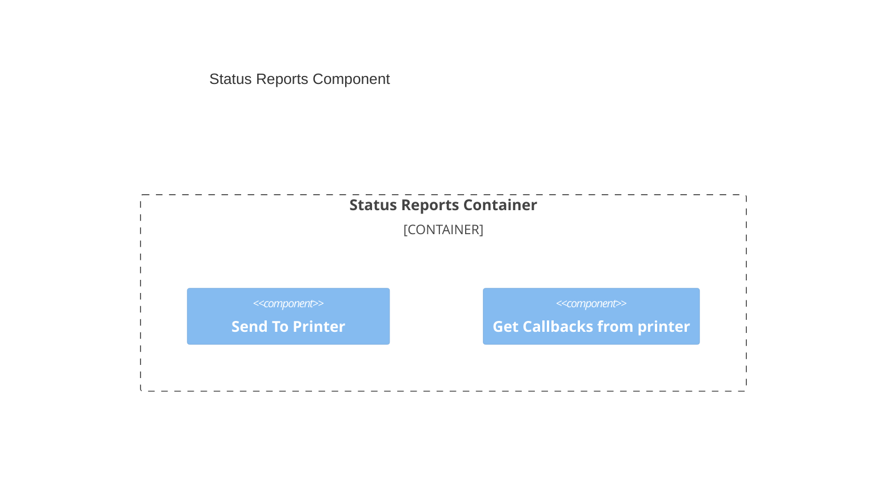

---

title: c4component-statusreports

---

```mermaid
    C4Component
    title Status Reports Component
    Container_Boundary(meshcontainer, "Status Reports Container") {

         Component(timer, "Send To Printer")
         Component(poller, "Get Callbacks from printer")


    }
```
