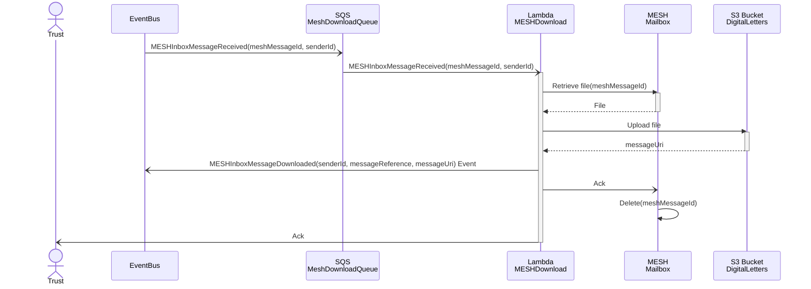

---

title: sequence-mesh-download

---

```mermaid

sequenceDiagram
  actor trust as Trust
  participant eventBus as EventBus
  participant sqs as SQS<br/>MeshDownloadQueue
  participant meshDownload  as Lambda<br/>MESHDownload
  participant meshMailbox as MESH<br/>Mailbox
  participant s3 as S3 Bucket<br/>DigitalLetters

  eventBus -) sqs: MESHInboxMessageReceived(meshMessageId, senderId)
  sqs -) meshDownload: MESHInboxMessageReceived(meshMessageId, senderId)
  activate meshDownload
    meshDownload ->> meshMailbox: Retrieve file(meshMessageId)
    activate meshMailbox
      meshMailbox -->> meshDownload: File
    deactivate meshMailbox
    meshDownload ->> s3: Upload file
    activate s3
      s3 -->> meshDownload: messageUri
    deactivate s3
    meshDownload -) eventBus: MESHInboxMessageDownloaded(senderId, messageReference, messageUri) Event
    meshDownload -) meshMailbox: Ack
    meshMailbox ->> meshMailbox: Delete(meshMessageId)
    meshDownload -) trust: Ack
  deactivate meshDownload
```
