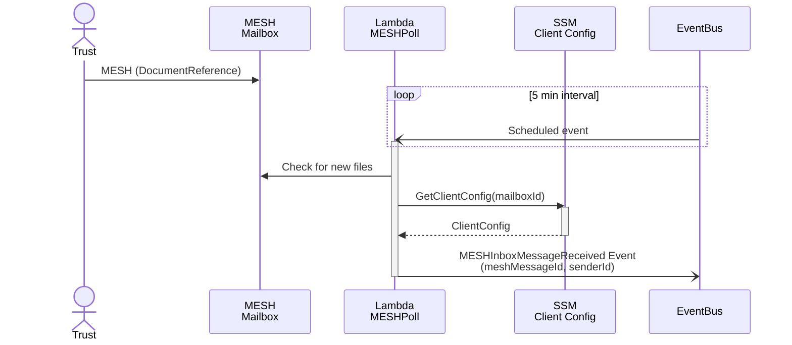

---

title: sequence-mesh-poller

---

```mermaid

sequenceDiagram
  actor trust as Trust
  participant meshMailbox as MESH<br/>Mailbox
  participant meshPoll as Lambda<br/>MESHPoll
  participant clientConfig as SSM<br/>Client Config
  participant eventBus as EventBus

  trust ->> meshMailbox: MESH (DocumentReference)

  Loop 5 min interval
    eventBus -) meshPoll: Scheduled event
    activate meshPoll
  end
  meshPoll ->> meshMailbox: Check for new files
  meshPoll ->> clientConfig: GetClientConfig(mailboxId)
  activate clientConfig
    clientConfig -->> meshPoll: ClientConfig
  deactivate clientConfig
  meshPoll -) eventBus: MESHInboxMessageReceived Event<br/>(meshMessageId, senderId)
  deactivate meshPoll

```
