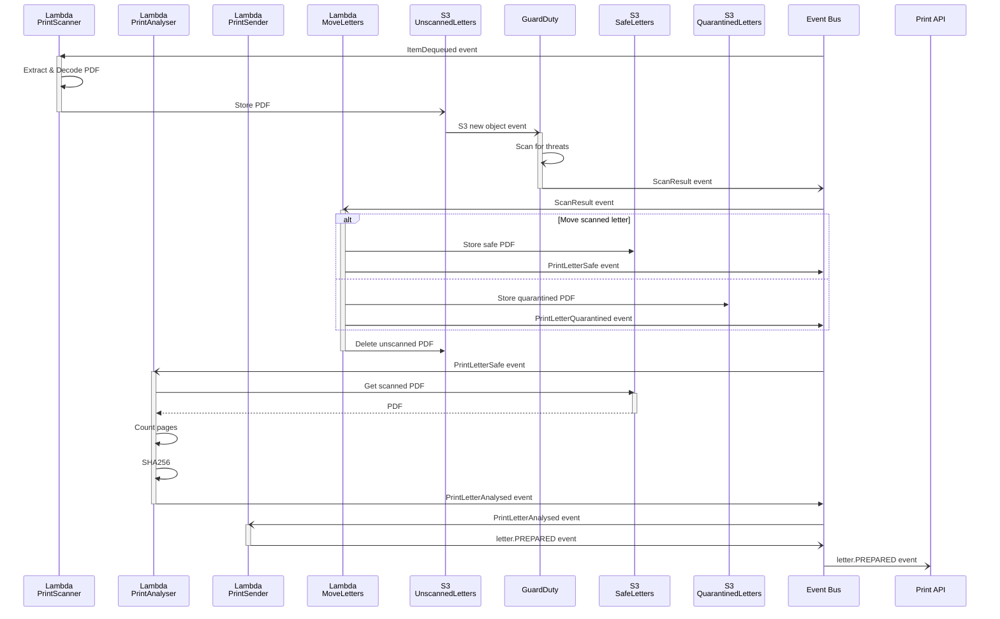

---

title: sequence-expire-print-ttl

---

```mermaid
sequenceDiagram
  participant scannerlambda as Lambda<br/>PrintScanner
  participant analyserLambda as Lambda<br/>PrintAnalyser
  participant senderLambda as Lambda<br/>PrintSender
  participant moveLambda as Lambda<br/>MoveLetters
  participant unscannedS3 as S3<br/>UnscannedLetters
  participant gd as GuardDuty
  participant safeS3 as S3<br/>SafeLetters
  participant quarantinedS3 as S3<br/>QuarantinedLetters
  participant eventBus as Event Bus
  participant printApi as Print API

  eventBus ->> scannerlambda: ItemDequeued event
  activate scannerlambda
  scannerlambda ->> scannerlambda: Extract & Decode PDF
        scannerlambda -) unscannedS3: Store PDF
  deactivate scannerlambda
  unscannedS3 -) gd: S3 new object event
  activate gd
      gd -) gd: Scan for threats
      gd -) eventBus: ScanResult event
  deactivate gd
  eventBus -) moveLambda: ScanResult event
  activate moveLambda
    alt Move scanned letter
      moveLambda ->> safeS3: Store safe PDF
      moveLambda ->> eventBus: PrintLetterSafe event
    else
      moveLambda ->> quarantinedS3: Store quarantined PDF
      moveLambda ->> eventBus: PrintLetterQuarantined event
  end
  moveLambda ->> unscannedS3: Delete unscanned PDF
  deactivate moveLambda
  eventBus -) analyserLambda: PrintLetterSafe event
  activate analyserLambda
  analyserLambda ->> safeS3: Get scanned PDF
        activate safeS3
                safeS3 -->> analyserLambda: PDF
        deactivate safeS3
  analyserLambda ->> analyserLambda: Count pages
  analyserLambda ->> analyserLambda: SHA256
  analyserLambda ->> eventBus: PrintLetterAnalysed event
  deactivate analyserLambda
  eventBus -) senderLambda: PrintLetterAnalysed event
  activate senderLambda
  senderLambda -) eventBus: letter.PREPARED event
  deactivate senderLambda
  eventBus -) printApi: letter.PREPARED event
```
