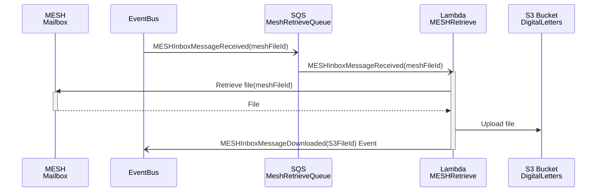

```mermaid

sequenceDiagram
  participant meshMailbox as MESH<br/>Mailbox
  participant eventBus as EventBus
  participant sqs as SQS<br/>MeshRetrieveQueue
  participant meshRetrieve  as Lambda<br/>MESHRetrieve
  participant s3 as S3 Bucket<br/>DigitalLetters

  eventBus -) sqs: MESHInboxMessageReceived(meshFileId)
  sqs -) meshRetrieve: MESHInboxMessageReceived(meshFileId)
  activate meshRetrieve
    meshRetrieve ->> meshMailbox: Retrieve file(meshFileId)
    activate meshMailbox
      meshMailbox -->> meshRetrieve: File
    deactivate meshMailbox
    meshRetrieve ->> s3: Upload file
    meshRetrieve -) eventBus: MESHInboxMessageDownloaded(S3FileId) Event
  deactivate meshRetrieve
```
