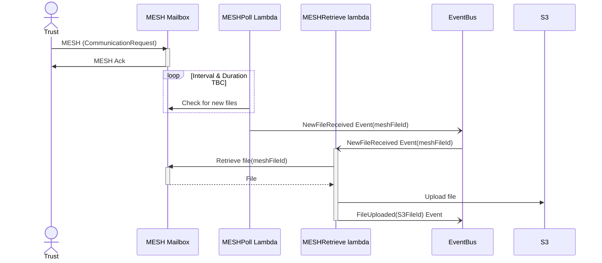

```mermaid

sequenceDiagram
  actor trust as Trust
  participant meshMailbox as MESH Mailbox
  participant meshPoll as MESHPoll Lambda
  participant meshRetrieve  as MESHRetrieve lambda
  participant eventBus as EventBus
  participant s3 as S3

  trust ->> meshMailbox: MESH (CommunicationRequest)
  activate meshMailbox
    meshMailbox ->> trust: MESH Ack
  deactivate meshMailbox

  Loop Interval & Duration TBC
    meshPoll ->> meshMailbox: Check for new files
  end

  meshPoll -) eventBus: NewFileReceived Event(meshFileId)

  eventBus -) meshRetrieve: NewFileReceived Event(meshFileId)
  activate meshRetrieve
    meshRetrieve ->> meshMailbox: Retrieve file(meshFileId)
    activate meshMailbox
      meshMailbox -->> meshRetrieve: File
    deactivate meshMailbox
    meshRetrieve ->> s3: Upload file
    meshRetrieve -) eventBus: FileUploaded(S3FileId) Event
  deactivate meshRetrieve
```
